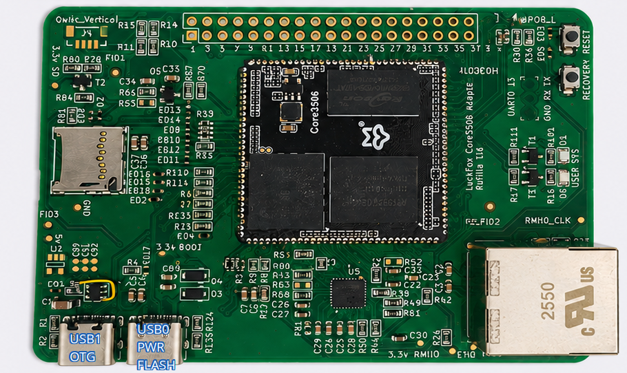
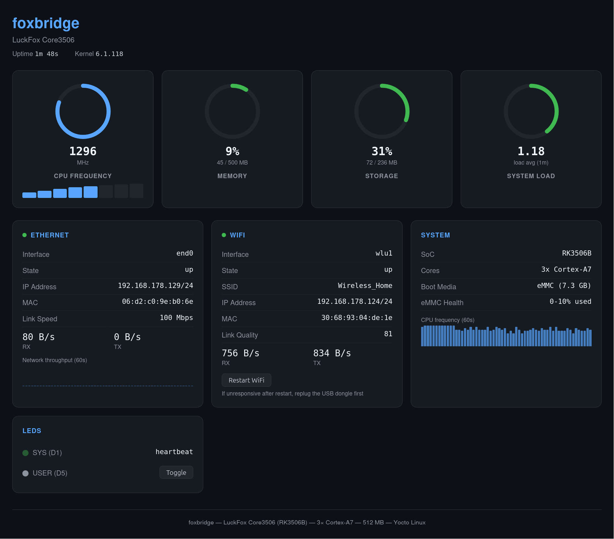

# LuckFox Yocto Layers — RK3506

**Status: v1.3.0** — Bootable on Foxbridge Rev A carrier with the LuckFox Core3506 SoM. Ethernet, USB1 host, and USB WiFi (RTL8188EU) verified end-to-end on hardware. Ships the on-board PicoClaw agent + `foxbridge-mcp` server (see [PICOCLAW.md](PICOCLAW.md)). 7"/10.1" DSI panel (display + capacitive touch) verified on hardware (see [DSI_PANEL.md](DSI_PANEL.md)).

See [FLASHING.md](FLASHING.md) for end-user flashing instructions.

See [PICOCLAW.md](PICOCLAW.md) for the on-board AI agent (PicoClaw + foxbridge-mcp): setup, architecture, known issues.

## Companion hardware

These layers accompany the **Foxbridge carrier board**, whose design files are
published separately at
[Rufilla/LuckFox-Core3506-Carrier](https://github.com/Rufilla/LuckFox-Core3506-Carrier).
The carrier takes a LuckFox Core3506 SoM and breaks out Ethernet, USB host and
OTG, the DSI panel connector, UART0 console and the BOOT/RESET test pads this
repository's flashing instructions refer to.

The images built here target that carrier (`MACHINE = "luckfox-core3506"`) and
assume its pinout. They will boot on a bare Core3506 SoM, but Ethernet, USB
host, the DSI panel and the status LEDs all depend on carrier routing — see
[BRIEFING.md](BRIEFING.md) §3 for what the device tree assumes.



## Overview

Yocto Project layers for building Linux images targeting the LuckFox family of
embedded boards based on the Rockchip RK3506 SoC.

**Current target:** LuckFox Core3506 (RK3506B) with 8 GB eMMC on carrier board.

### Measured performance (Foxbridge Rev A + Core3506-0808)

| Metric | Value | Notes |
|--------|-------|-------|
| CPU | 3x Cortex-A7, DVFS 600–1608 MHz (8 OPPs) | Per-core DVFS; governor scales on load |
| Ethernet | 100 Mbps full-duplex (100BASE-TX) | RMII + CH182H2 PHY; ~11 MB/s wire-rate |
| eMMC read | ~22 MB/s sequential (cold cache) | 8 GB Foresee 8GTF4R, HS mode 50 MHz bus, `dd bs=1M` |
| USB1 host | 480 Mbps (USB2 HS), ~35 MB/s raw read | Kingston DataTraveler 3.0, `dd` from `/dev/sda` |
| RAM footprint | ~23 MB used of 500 MB | After boot, no USB devices |
| Boot to network | ~6 s | Kernel entry to Ethernet link up + SSH-ready (CRNG seeded) |
| Idle power | 0.30 W (0.06 A @ 5.07 V) | No USB devices attached, Ethernet connected |
| CPU stress power | 0.61 W (0.12 A @ 5.07 V) | All 3 cores saturated at 1608 MHz |
| stress-ng CPU | 86.6 bogo ops/s (matrixprod, 3 workers) | 10 s run, all cores at max freq |
| stress-ng VM | 4167 bogo ops/s (128 MB, 1 worker) | 10 s run, memory thrash |
| stress-ng combined | CPU 228 + VM 5003 + HDD 179 bogo ops/s | 15 s, 3 CPU + 1 VM + 1 HDD simultaneous |

### How it compares

The RK3506 sits in a niche between the original Pi Zero W (1× ARM11 @ 1 GHz, 512 MB) and the Pi Zero 2 W (4× Cortex-A53 @ 1 GHz, 512 MB). With 3× Cortex-A7 at 1.6 GHz it beats the original Zero on both core count and clock, and gets to within spitting distance of the Zero 2 W on single-threaded A-class workloads — while drawing roughly **a quarter of the Zero 2 W's idle power** (0.30 W vs ~1.2 W). Compared to the BeagleBone Black (1× A8 @ 1 GHz) it offers 3× the threads at similar RAM. It trails all of these on RAM (512 MB DDR3L is fixed on-module) and has no GPU/VPU in this configuration.

### What it's useful for

The combination of sub-1 W power, three A7 cores, hardwired Ethernet, and a full Yocto/systemd userspace makes this board a good fit for **always-on headless embedded roles** where a Pi is overkill on power but an MCU is underpowered on software stack:

- **IoT gateways and protocol bridges** (MQTT, Modbus, CAN-over-USB, BLE bridges)
- **Edge sensor hubs and telemetry collectors** — modest CPU, lots of I/O, low thermal budget
- **Industrial/automation controllers** where deterministic Linux with a vendor BSP matters
- **Small edge-AI orchestrators** — e.g. the bundled PicoClaw agent runtime, calling out to cloud LLMs and driving local hardware via MCP
- **PoE-powered or battery-backed deployments** where every 100 mW counts

It's **not** a good fit for desktop-ish workloads, video decode, ML inference on-device, or anything that wants >512 MB RAM — reach for a Pi 4/5 or RK3588-class board for those.

### What's included

| Layer | Purpose |
|-------|---------|
| `meta-rockchip-rk3506` | SoC vendor layer: kernel 6.1.x, U-Boot 2017.09, rkbin blobs |
| `meta-luckfox-bsp` | Board layer: machine configs, wks partition layouts |
| `meta-luckfox-distro` | Distro layer: image recipes, packagegroups, distro policy |

### What's NOT included

- **Mainline kernel support** — does not exist for RK3506
- **On-board WiFi/BT** — Core3506 SoM has no radio. **USB WiFi dongles work** via the included `foxbridge-wifi` recipe (see "After flashing" below).
- **Display/LVGL support** — deferred
- **AMP multi-core firmware** — out of scope (Linux side only)
- **RV1106 / Pico series** — out of scope; this repo is RK3506-only.

## Prerequisites

- Yocto Project **scarthgap** or **styhead** release
- ~50 GB free disk space for the build
- Internet access for source downloads
- A USB-serial adapter for the carrier's UART0 console (any standard 3.3V TTL adapter; see [Serial Console](#serial-console))
- For flashing: `rkdeveloptool` and a USB-C cable to the OTG0 port (see [FLASHING.md](FLASHING.md))

## Quick Start

```bash
# 1. Clone poky (scarthgap branch)
git clone -b scarthgap https://git.yoctoproject.org/poky
cd poky

# 2. Clone this repository alongside poky
cd ..
git clone https://github.com/Rufilla/LuckFox-core3506-yocto luckfox-yocto

# 3. Initialize the build environment
cd poky
source oe-init-build-env ../build-core3506

# 4. Copy config samples
cp ../luckfox-yocto/bblayers.conf.sample conf/bblayers.conf
cp ../luckfox-yocto/local.conf.sample conf/local.conf

# 5. Edit conf/bblayers.conf — update POKY_DIR and LUCKFOX_DIR paths
#    to match your actual directory layout.

# 6. Build the minimal image
bitbake luckfox-image-minimal
```

## Boot Chain

```
BootROM (mask ROM, hardcoded in SoC)
  → idbloader.img (DDR init + SPL, written at sector 64)
    → uboot.img (U-Boot + OP-TEE FIT image)
      → Linux kernel (vendor BSP 6.1.x)
```

**All boot stages before U-Boot require proprietary Rockchip blobs** from the
rkbin repository. These are fetched automatically during the build but require
`LICENSE_FLAGS_ACCEPTED += "commercial"` in local.conf.

## Pinned Source Versions

| Component | Repository | Branch | Commit |
|-----------|-----------|--------|--------|
| rkbin | rockchip-linux/rkbin | master | `74213af1e952c4683d2e35952507133b61394862` |
| Kernel | rockchip-linux/kernel | develop-6.1 | `d2b4477a1df699e6639e83837c7dc45ea1d1d73f` |
| U-Boot | rockchip-linux/u-boot | next-dev | `b14196eade471bbc000c368f8555f2a2a1ecc17d` |
| OP-TEE (source) | OP-TEE/optee_os | master | `298746f9e2907886dcf68a0586b9fb0671ad7043` |

The secure world is built from **public upstream OP-TEE** by default
(`OPTEE_PROVIDER = "optee-os-rk3506"`, recipe
`optee-os-rk3506_4.10.0+git.bb`). The RK3506 `plat-rockchip` flavor is upstream
in mainline `master` (RFC #7820); the pinned rev carries the platform port plus
the shared-UART0 `CFG_8250_UART_FLUSH_TIMEOUT` flush fix. Set
`OPTEE_PROVIDER = "rkbin"` to fall back to the byte-identical vendor blob.

## Future: Migrate to `bitbake-setup`

BitBake 2.16+ introduces [`bitbake-setup`](https://docs.yoctoproject.org/bitbake/2.16/bitbake-user-manual/bitbake-user-manual-environment-setup.html),
a replacement for the `setup-layers` / `setup-build` workflow. It adds
interactive configuration selection, registries, and built-in update/sync.

**Plan:** Migrate when the next Yocto LTS (**Wrynose 6.0**, expected April 2026)
is released, provided it ships BitBake 2.16+. The migration involves:

1. Replace `setup-layers.json` with a `bitbake-setup` generic configuration JSON
   (the `sources` section maps directly; add a `bitbake-setup.configurations`
   block for machine/distro selection).
2. Remove `setup-layers` script and `bblayers.conf.sample` (both replaced by
   `bitbake-setup init`).
3. Update Quick Start instructions to use `bitbake-setup init` + `source init-build-env`.

Until then, the current `setup-layers` + `bblayers.conf.sample` workflow remains
the supported approach on scarthgap LTS.

## After flashing — connect to WiFi

The image ships with `foxbridge-wifi` enabled. On first boot it runs but no-ops because the placeholder config still contains the `CHANGEME` marker. To activate WiFi:

```bash
# On the board:
vi /etc/wpa_supplicant/wpa_supplicant-wlan.conf
#   Replace CHANGEME_SSID and CHANGEME_PSK with real values.
systemctl restart foxbridge-wifi
journalctl -u foxbridge-wifi --no-pager   # confirm bringup
ip -4 addr show
```

The status page at `http://foxbridge.local/` (Avahi advertises this hostname automatically) shows live Ethernet and WiFi state including SSID, IP, MAC, and link quality:



## Roadmap

### v1.0.0 (released)
- [x] Vendor kernel 6.1.x (rockchip-linux BSP)
- [x] Vendor U-Boot 2017.09 with distro boot patches
- [x] eMMC WIC image (boots end-to-end, verified on Foxbridge Rev A)
- [x] systemd, SSH, basic networking
- [x] Ethernet (RMII, gmac0) — verified on Foxbridge carrier
- [x] USB1 host (OTG1) — mass storage at 35 MB/s, USB2 HS enumeration verified
- [x] USB WiFi via TL-WN725N (Realtek RTL8188EU, staging `r8188eu` driver)
- [x] `foxbridge-wifi` recipe — auto-bringup with placeholder config + CHANGEME guard
- [x] `foxbridge-status` — lighttpd CGI status page over Avahi/mDNS

### v1.1.0 – v1.3.0 (released)
- [x] Live status dashboard (`foxbridge-status`) over lighttpd + Avahi/mDNS
- [x] `foxbridge-mcp` — MCP server giving the on-board PicoClaw agent safe,
      unprivileged access to LEDs, GPIOs and read-only system state
- [x] **7"/10.1" DSI panel — display, touch and boot splash, verified on
      hardware.** Opt in with `MACHINE_FEATURES:append = " screen"`. The panel is
      the Luckfox 10.1-DSI-TOUCH-A (800×1280 IPS, Goodix GT9271 touch); touch
      runs in poll mode because the panel FPC exposes no INT line on this
      carrier. Full bring-up record, including the backlight MCU and the
      rotation handling, is in [DSI_PANEL.md](DSI_PANEL.md).
- [x] Framebuffer DOOM (`doomgeneric` + Freedoom) as a demo payload
      (`LUCKFOX_DOOM=1`)
- [x] SWUpdate A/B OTA milestone M1 (opt-in; see below)

Per-release detail is in [CHANGELOG.md](CHANGELOG.md) and `release/<version>/`.

### Future (post-v1.0.0)
- [ ] USB OTG0 (currently used only for maskrom flashing)
- [ ] Bluetooth bringup
- [ ] LVGL on top of the DSI panel
- [ ] Locked root + SSH key auth (currently `debug-tweaks` is on for bringup)

### SWUpdate A/B OTA (milestone M1 — implemented)

Field-safe over-the-air updates using [SWUpdate](https://sbabic.github.io/swupdate/)
with A/B rootfs+boot partitioning and U-Boot env-driven slot selection + automatic
rollback. **Implemented and HW-verified end-to-end** (first flash → A/B boot →
rollback → full `.swu` apply → slot switch → mark-good commit). Full design,
as-built details, and remaining items are in [OTA_SWUPDATE_PLAN.md](OTA_SWUPDATE_PLAN.md).

**Opt-in** — the default image is unchanged (lean single-slot). Build the A/B OTA
image with `LUCKFOX_OTA = "1"` in `conf/local.conf`; create an update with
`scripts/build-ota.py`; apply on the device with `ota-apply <file>.swu`.

What's implemented: persistent U-Boot env in eMMC; `ab_select` env-script slot
selector + script-managed try-counters; 6-partition GPT A/B layout (512 MiB
slots); `meta-swupdate` + the SWUpdate daemon/web-UI; dual-slot `.swu` generation;
`ota-env-init` / `ota-mark-good` / `ota-apply`.

**Remaining (M1):** power-fail test + hardening (redundant env, watchdog, mark-good
health check). **Later:** signed `.swu` (M2), recovery slot (M3), hawkBit remote.

**Key constraints:**
- Single MMC controller — no SD card fallback during OTA
- 8 GB eMMC budget: ~512 MB per rootfs slot (2.5× current rootfs) + boot + ~6 GB /data staging
- Vendor U-Boot 2017.09 has no built-in A/B support — custom env-script boot logic
- **Bootloader is NOT OTA-upgradeable** — BootROM loads idbloader/u-boot.img from
  fixed raw offsets with no A/B; OP-TEE is bundled in u-boot.img (changed only via
  maskrom reflash). OTA updates rootfs + boot only.

## Known Limitations

1. **Brief garble at very start of boot.** The first ~1 second of boot — TPL DDR init (`rk3506b_ddr_750MHz_v1.06.bin`) and the initial OP-TEE blob stage — prints at 1500000 baud because those are closed-source blobs we can't recompile. Everything after that (U-Boot SPL, OP-TEE runtime, U-Boot proper, kernel, userspace) is at 115200, readable on any standard USB-serial adapter including CH340/CP2102/FT232. If you want a completely clean log from power-on, your terminal would need to briefly switch baud — in practice just ignore the first second of garbage. The U-Boot side of this was fixed by disabling `CONFIG_ROCKCHIP_PRELOADER_SERIAL` in `meta-rockchip-rk3506/recipes-bsp/u-boot/files/rk3506-distroboot.config`; that turns off the code path in `arch/arm/mach-rockchip/param.c:param_parse_pre_serial()` that otherwise inherits the 1500000 baud from the TPL's ATAG_SERIAL and ignores `CONFIG_BAUDRATE`.

2. **`debug-tweaks` enabled** — image ships with empty root password, no SSH key requirement. Suitable for bringup; harden before deploying.

3. **WiFi with TL-WN725N / RTL8188EU is functional but not rock-solid.** The in-tree `r8188eu` driver is staging quality. It associates and passes traffic, but can silently drop the radio after extended uptime. We ship `/etc/modprobe.d/r8188eu.conf` with `rtw_power_mgnt=0 rtw_ips_mode=0` — the standard mitigation for the power-save-related silent disconnects — but this does not eliminate all flakiness; physical replug is occasionally still needed. For reliable production WiFi, prefer a dongle supported by the mainline `rtl8xxxu` driver (RTL8192CU, RTL8188CUS, RTL8192EU, RTL8723BU, etc.). `rtl8xxxu` is already built in our kernel (`CONFIG_RTL8XXXU=m` + `CONFIG_RTL8XXXU_UNTESTED=y`); those dongles should just work without recipe changes. Also: `r8188eu` exposes only Wireless Extensions (WEXT), not nl80211 — `foxbridge-wifi` handles this transparently by passing `-Dwext` to `wpa_supplicant`, which is also fine for `rtl8xxxu` dongles.

   **Recovering a stuck r8188eu** — if WiFi stops passing traffic (ping fails, `http://foxbridge.local/` times out), check the symptom and apply the lightest fix that works:
   ```sh
   # 1. Diagnose. If the "level" column shows -256 or 0, the radio is stuck.
   cat /proc/net/wireless
   wpa_cli -i wlu1 status | grep wpa_state     # may still say COMPLETED while stuck

   # 2. Try a soft restart first — fixes most transient glitches
   systemctl restart foxbridge-wifi
   # Wait ~10 s, then re-check /proc/net/wireless and ping the gateway.

   # 3. If level is still -256/0, the driver is wedged. Physically unplug
   #    and replug the USB WiFi dongle, then re-run the restart:
   systemctl restart foxbridge-wifi

   # 4. If that still fails, reboot the whole board:
   reboot
   ```
   The lightest fix (#2) resolves the common "associated but power-saved out" case. Step #3 is needed when the driver itself has locked up its internal state machine — USB unbind/rebind from sysfs does not always recover it, only a physical re-enumeration does. If you're hitting step #3 regularly, it's a strong signal to swap in an `rtl8xxxu`-supported dongle instead.

4. **No on-board WiFi/BT** — Core3506 has no radio. USB dongle is the only path.

5. **Carrier-board hardware errata** — Foxbridge Rev A had two USB1 hardware bugs (E1: VBUS pull-up, E2: 22 Ω series Rs on D+/D-) that were fixed by rework. See [DEV_SETUP.md](DEV_SETUP.md) for the rework details. Rev B will incorporate both fixes natively.

6. **eMMC and SD card cannot be used simultaneously** — see next section.

## SoC Constraint: eMMC and SD card share one controller

The RK3506 has **only one SDMMC controller** (`mmc@ff480000`). On a Core3506-0808 SoM, the on-module eMMC is hardwired to that controller via the SoM's internal routing, and the carrier's SD card slot is wired to the *same* controller pins on the module connector. The two devices physically share the bus — they cannot be used at the same time, and there is no way to switch between them at runtime without re-routing pinmux and re-probing. In practice this means: **with a Core3506-0808 (eMMC variant) SoM, the carrier's SD slot is non-functional**. With a Core3506-0000 (no-eMMC variant) the SD slot is the only boot medium.

This was verified during bringup with three independent checks:

1. **Vendor U-Boot DTSI** — `arch/arm/dts/rk3506.dtsi` defines exactly one `mmc@ff480000` node and the U-Boot aliases section maps `mmc0 = &mmc` with no `mmc1`. There is no second controller to enable.
2. **Pinctrl tracing** — the `sdmmc_clk_pins`, `sdmmc_cmd_pins`, and `sdmmc_bus4_pins` groups in the SoC DTSI route to GPIO3_A0–A5, which on the Core3506-0808 module connector are pins 101–106. The carrier SD slot wiring on the Foxbridge schematic terminates on the same pins. Verified against the LuckFox pinout spreadsheet — same pins on both sides of the connector.
3. **BootROM behavior** — on power-up the RK3506 BootROM probes the SDMMC controller and selects the first responding device; on a Core3506-0808 SoM that's always the on-module eMMC because it sits closer on the bus and answers first. Even with an SD card inserted, the BootROM will not see it. Confirmed by attempting to flash an SD card image via the carrier slot and observing the BootROM never enters the SD probe path (jumps straight to eMMC). The vendor SDK documents the same behavior.

There is also a software-side gotcha: vendor U-Boot's `arch_cpu_init()` calls `board_set_iomux(MMC)` which overwrites the BootROM's pin configuration — so even if you tried to hack a runtime switch, U-Boot would clobber it before Linux ran. This is documented in [BRIEFING.md](BRIEFING.md) §3.4.

**Bottom line:** if you have a Core3506-0808, treat the carrier's SD slot as non-functional and flash via maskrom + `rkdeveloptool` (see [FLASHING.md](FLASHING.md)). If you have a Core3506-0000 (no on-module eMMC), use `bitbake luckfox-image-sdcard` and `dd` the WIC to an SD card from a host PC.

## Architecture

[BRIEFING.md](BRIEFING.md) is the full technical reference:

- Binary blobs, their licensing, and how they are assembled into boot images (§1)
- Vendor kernel rationale and defconfig assumptions (§2)
- Device tree hierarchy — what is custom vs inherited (§3)
- U-Boot fork and the patches applied (§4)
- Boot chain and partition layout (§5)
- Build reproducibility and pinned sources (§6)
- Key risks and open questions (§7)

## Security

**The default image is not hardened.** It ships with `debug-tweaks` enabled,
meaning an empty root password and root SSH login — fine for bench bring-up,
unsuitable for anything on an untrusted network. See *Known Limitations* above.

Other defaults worth knowing before you deploy anything built from these layers:

- The signed boot chain (signed U-Boot FIT, signed kernel FIT, dm-verity
  rootfs) is **opt-in and un-fused** — the root of trust is software-anchored,
  not burned into the SoC.
- OTA (`LUCKFOX_OTA = "1"`) ships **unsigned** `.swu` payloads at milestone M1.
- WiFi PSKs are stored in plaintext in `/etc/wpa_supplicant/`.
- The boot chain starts in closed Rockchip blobs that cannot be audited or
  rebuilt — see [BRIEFING.md](BRIEFING.md) §1.
- PicoClaw is a pre-1.0 upstream project shipped as a prebuilt binary; upstream
  warns against production use.

**No security updates are promised for any version**, and this project is
unsupported. To report a vulnerability anyway, use GitHub's *Security → Report
a vulnerability* on this repository for a private advisory rather than opening
a public issue. Reports are read on a best-effort basis, with no guaranteed
response.

If you build a product on these layers and place it on the EU market, the
Cyber Resilience Act obligations are yours, not ours — vulnerability handling,
a reporting route, SBOM and security updates for the support period you define.

## Licence

MIT — see [LICENSE](LICENSE). © 2026 Rufilla Ltd.

Third-party components keep their own licences; the pinned upstreams and their
terms are listed in [THIRD_PARTY_LICENSES.md](THIRD_PARTY_LICENSES.md).

**The proprietary Rockchip boot blobs (rkbin) are not MIT and are not covered
by this licence.** They are fetched at build time and require
`LICENSE_FLAGS_ACCEPTED += "commercial"`. Rockchip publishes no explicit
redistribution terms for rkbin — review this before redistributing built
images commercially (see [BRIEFING.md](BRIEFING.md) §1.2).

## Support

**None.** This repository is published as-is, with no support, no warranty and
no commitment to security updates or maintenance releases.

Rufilla Ltd · Building D5, Culham Campus, Abingdon, Oxfordshire, UK, OX14 3DB
[hello@rufilla.com](mailto:hello@rufilla.com) · [www.rufilla.com](https://www.rufilla.com)

© 2026 Rufilla Ltd
